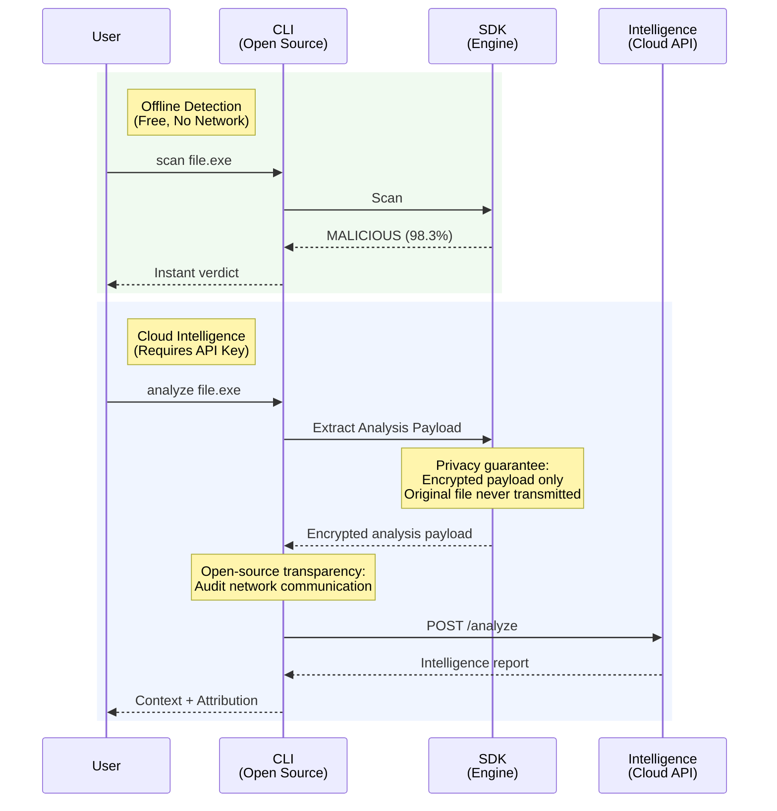

# SemanticsAV CLI

[](LICENSE)
[](EULA.md)
[]()

> AI-native malware detection: CLI tools, daemon, and API interface for offline scanning and cloud intelligence

**Offline Detection • Cloud Intelligence • Privacy-by-Design**

---

## Quick Demo

<p align="center">
  
</p>

---

## What Is SemanticsAV?

SemanticsAV provides AI-native malware analysis through three components:

| Component | Description |
|-----------|-------------|
| **SDK** | AI-native offline malware scanner. Detects threats locally without internet connection using learned pattern recognition instead of signature matching. |
| **CLI** | Command-line interface, system daemon, and transparent network layer for all platform operations (this repository). |
| **Intelligence** | Optional explainable AI layer that reveals *why* verdicts occur through campaign mapping and threat context. **[Try demo →](https://demo.semanticsav.ai)** |

**Key Capabilities:**

- **Offline Scanner**: Complete malware scanning without network dependency during analysis
- **Novel Threat Detection**: AI-based detection identifies previously unseen malware variants without requiring signature updates
- **Explainable Verdicts**: Understand verdict reasoning with attack campaign identification and threat vector analysis
- **Privacy-First**: SDK has zero network capability. All communication occurs through auditable open-source CLI
- **Free on Linux**: Unlimited scanning for personal, commercial, and service provider use

---

## Quick Start

### Installation

**User Installation** (recommended for personal use):
```bash
curl -sSL https://raw.githubusercontent.com/metaforensics-ai/semantics-av-cli/main/scripts/install.sh | bash -s -- --user
```

**System Installation** (for server/multi-user environments):
```bash
curl -sSL https://raw.githubusercontent.com/metaforensics-ai/semantics-av-cli/main/scripts/install.sh | bash -s -- --system
```

### Initial Setup
```bash
# 1. Configure
semantics-av config init --defaults

# 2. Update detection models
semantics-av update

# 3. Start scanning
semantics-av scan /path/to/file
```

### Optional: Enable Cloud Intelligence
```bash
# Get your API key from: https://console.semanticsav.ai

# Configure API key
semantics-av config set api_key "your-api-key-here"

# Analyze with full intelligence report
semantics-av analyze suspicious.exe --format html -o report.html
```

---

## Supported File Formats

**Currently Supported:**
- **PE (Portable Executable)**: Windows executables (.exe, .dll, .sys)
- **ELF (Executable and Linkable Format)**: Linux/Unix executables and shared objects

**Expanding Coverage:**

The platform is actively expanding to cover document formats (Office, PDF), script languages (JavaScript, PowerShell, Python), mobile executables (APK, IPA), and specialized binary formats (Mach-O, Java bytecode, .NET assemblies).

---

## Model Distribution

Both Community and Commercial editions receive production-ready detection models. Differences may occur due to update timing (critical threats may receive priority commercial updates), confidential data (models trained on NDA-protected samples), or specialized requirements (industry-specific deployments).

---

## Installation

### System Requirements

| Requirement | Specification |
|------------|---------------|
| **Operating System** | Linux (glibc compatibility required) |
| **Architecture** | x86_64 or aarch64 (ARM64) |
| **Compiler** | GCC 10+ or Clang 12+ with C++20 support |
| **Build System** | CMake 3.16 or later |
| **Network** | Internet connection for build-time dependency downloads |

**SemanticsAV SDK Binary Compatibility:**

| Architecture | Minimum Requirements | Officially Supported On |
|:-------------|:--------------------|:------------------------|
| **x86_64** | `glibc >= 2.17`<br>`libstdc++ >= 3.4.19` (GCC 4.8.5) | RHEL/CentOS 7+, Ubuntu 16.04+, Debian 9+ |
| **aarch64 (ARM64)** | `glibc >= 2.27`<br>`libstdc++ >= 3.4.22` (GCC 6.1) | RHEL/AlmaLinux 8+, Ubuntu 18.04+, Debian 10+ |

**Verify your system compatibility:**
```bash
# Check glibc version
ldd --version

# Check libstdc++ version
strings /usr/lib64/libstdc++.so.6 | grep GLIBCXX  # or /usr/lib/x86_64-linux-gnu/libstdc++.so.6
```

### Manual Installation (From Source)
```bash
# Clone repository
git clone https://github.com/metaforensics-ai/semantics-av-cli.git
cd semantics-av-cli

# Build
mkdir build && cd build
cmake -DCMAKE_BUILD_TYPE=Release ..
make -j$(nproc)

# System-wide installation (requires root)
sudo make install
sudo /usr/local/share/semantics-av/post_install.sh

# Or user-local installation (no root required)
cmake -DCMAKE_INSTALL_PREFIX=~/.local ..
make install
~/.local/share/semantics-av/post_install_user.sh
export PATH="$HOME/.local/bin:$PATH"
```

---

## Usage Guide

### Configuration

**Quick setup:**
```bash
semantics-av config init --defaults
```

**View configuration:**
```bash
semantics-av config show
```

**Set specific values:**
```bash
semantics-av config set log_level DEBUG
semantics-av config set scan.default_threads 8
```

**Configuration locations:**
- System mode: `/etc/semantics-av/semantics-av.conf`
- User mode: `~/.config/semantics-av/config.conf`

### API Key Configuration

Required for cloud analysis features. Obtain your API key from [SemanticsAV Console](https://console.semanticsav.ai).
```bash
semantics-av config set api_key "sav_your_api_key_here"
```

### Model Management
```bash
# Download latest models
semantics-av update

# Check for updates without downloading
semantics-av update --check-only

# Force complete model re-download
semantics-av update --force
```

### Scanning Files (Offline, Free)

**Basic scanning:**
```bash
# Scan single file
semantics-av scan /path/to/file.exe

# Recursive directory scan
semantics-av scan /path/to/directory -r -t 8

# Show only infected files
semantics-av scan /path/to/directory -r -i

# Include file hashes
semantics-av scan /path/to/file.exe -H

# JSON output
semantics-av scan /path/to/file.exe --json
```

### Cloud Analysis (Requires API Key)

**Generate forensic intelligence reports:**
```bash
# Basic analysis
semantics-av analyze /path/to/suspicious.exe

# HTML report (opens in browser)
semantics-av analyze suspicious.exe --format html -o report.html

# Markdown report
semantics-av analyze suspicious.exe --format markdown -o report.md

# Multi-language support (en, ko, ja, zh, es, fr, de, it, pt, ru, ar)
semantics-av analyze suspicious.exe --language ko

# Skip natural language report generation
semantics-av analyze suspicious.exe --no-report
```

### Report Management
```bash
# List all reports
semantics-av report list

# Filter by verdict/date/type
semantics-av report list --filter verdict:malicious
semantics-av report list --filter date:week

# Show specific report
semantics-av report show <report-id>

# Convert format
semantics-av report convert <report-id> --format html -o report.html

# Delete reports
semantics-av report delete <report-id>
semantics-av report delete --older-than 90
```

---

## Advanced Features

### Daemon Management

**Start/stop daemon:**
```bash
# System daemon
sudo systemctl start semantics-av
sudo systemctl stop semantics-av
sudo systemctl status semantics-av

# User daemon
systemctl --user start semantics-av
systemctl --user stop semantics-av
systemctl --user status semantics-av

```

### HTTP API Integration

When daemon is running, REST API is available at `http://127.0.0.1:9216` (configurable).

**Scan file:**
```bash
curl -X POST http://127.0.0.1:9216/api/v1/scan \
     -F "file=@suspicious.exe"
```

**Response:**
```json
{
  "success": true,
  "data": {
    "result": "MALICIOUS",
    "confidence": 0.983,
    "file_type": "pe",
    "scan_time_ms": 127
  }
}
```

**Additional endpoints:**
- `POST /api/v1/analyze`: Cloud analysis
- `POST /api/v1/models/update`: Update models
- `GET /api/v1/status`: Daemon status
- `GET /api/v1/health`: Health check

### Unix Socket Integration

For high-performance local integration:
- System: `/var/run/semantics-av/semantics-av.sock`
- User: `~/.local/state/semantics-av/semantics-av.sock`

Binary protocol with zero-copy file descriptor passing. Specification in `include/semantics_av/daemon/protocol.hpp`.

---

## Architecture

SemanticsAV operates in two modes: offline malware detection and optional cloud intelligence.


**Privacy-First Architecture:**

The SemanticsAV SDK performs complete AI-based malware analysis locally without any network dependency. Your files never leave your system during scanning. When using the Intelligence API, only an encrypted, proprietary analysis payload is transmitted. The original file is never uploaded and cannot be reconstructed from the payload. All network communication occurs through the open-source CLI wrapper, enabling you to audit exactly what data is transmitted.

See [PRIVACY_POLICY.md](PRIVACY_POLICY.md) for complete data handling practices.

---

## Maintenance

### Uninstallation
```bash
curl -sSL https://raw.githubusercontent.com/metaforensics-ai/semantics-av-cli/main/scripts/uninstall.sh | bash
```

The uninstaller automatically detects installation type and optionally removes configuration/data files.

---

## License & Platform Support

### Linux SDK: Free for All Commercial Uses

The **SemanticsAV SDK for Linux** is provided under a **perpetual, royalty-free EULA**. All commercial uses are permitted including service delivery, product integration, and redistribution, subject only to the terms specified in the EULA (no reverse engineering, no competitive development, mandatory attribution).

**Full details:** [EULA.md](EULA.md)

### Component Licensing

| Component | License | Details |
|-----------|---------|---------|
| **SemanticsAV CLI** | [MIT](LICENSE.md) | Full rights: modify, distribute, commercial use |
| **SemanticsAV SDK (Linux)** | [EULA](EULA.md) | All commercial uses permitted under EULA terms |
| **SemanticsAV Intelligence** | [Terms of Service](INTELLIGENCE_TOS.md) | Subscription service, separate terms |

### When You Need a Commercial License

Commercial licenses are available for:

- **Cross-Platform Deployment**: Windows, macOS, and other non-Linux platforms
- **Customized Advanced Features**: Tailored detection models and specialized deployments
- **Commercial Intelligence Integration**: Services that redistribute Intelligence analysis to customers
- **Enterprise Support**: Dedicated technical support, custom SLAs, professional services

**Licensing inquiries:** sales@metaforensics.ai

---

## Contributing

**Contributions welcome** to MIT-licensed wrapper code:
- CLI commands and features
- Daemon optimizations and protocols
- Output formatters and report generators
- Build system and packaging improvements
- Documentation and examples

**Not modifiable:** SemanticsAV SDK (proprietary binary)

**Process:** Fork → Feature branch → Pull request

---

## Support

| Type | Contact |
|------|---------|
| 🐛 Bug Reports (CLI/Wrapper) | [GitHub Issues](https://github.com/metaforensics-ai/semantics-av-cli/issues) |
| 🔐 SDK Issues | contact@metaforensics.ai |
| 💼 Commercial Licensing | sales@metaforensics.ai |
| 🔒 Privacy Matters | privacy@metaforensics.ai |

**Legal Documents:**
- SDK EULA: [EULA.md](EULA.md)
- Intelligence ToS: [INTELLIGENCE_TOS.md](INTELLIGENCE_TOS.md)
- Privacy Policy: [PRIVACY_POLICY.md](PRIVACY_POLICY.md)
- Third-Party Licenses: [ThirdPartyNotices.txt](ThirdPartyNotices.txt)

---

<div align="center">

[Website](https://semanticsav.ai) • [Console](https://console.semanticsav.ai) • [Contact](mailto:contact@metaforensics.ai)

© 2025 Meta Forensics Corp. All rights reserved.

</div>