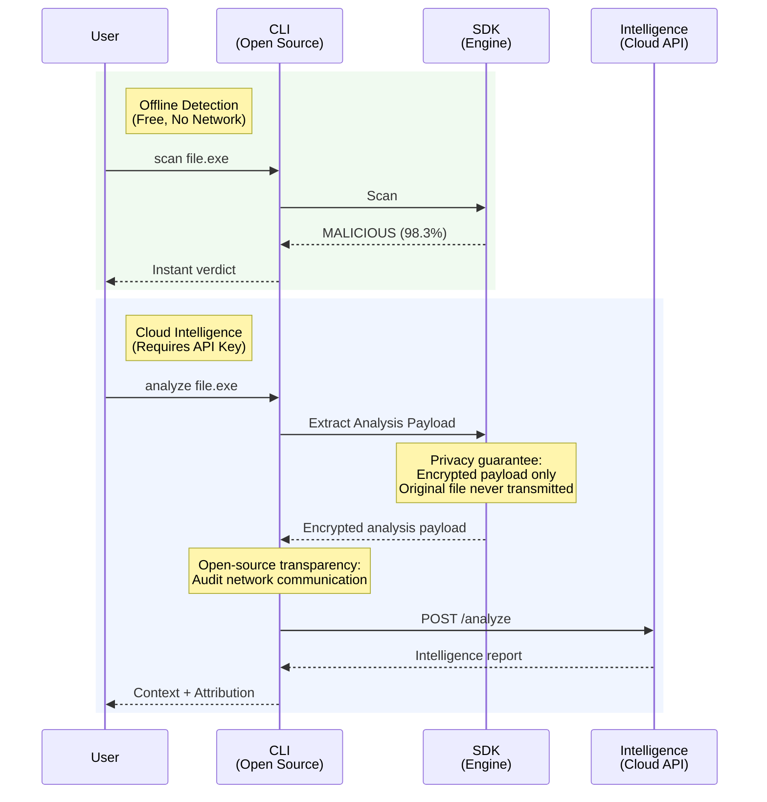

# SemanticsAV CLI

[](LICENSE)
[](EULA.md)
[]()

> **Gateway to SemanticsAV Platform:**  
> **CLI, daemon, and API servers for AI-native malware detection and threat intelligence.**

**Offline Zero-Day Detection • Real-Time Cloud Intelligence • Privacy-by-Design**

---

## What Is SemanticsAV Platform?

**SemanticsAV Platform delivers AI-native malware detection that analyzes what code *means*, not what it *looks like*.** By understanding semantic context and design intent—rather than matching syntactic patterns—it detects zero-day threats that evade traditional signature-based and sandbox approaches.

**Currently, the platform consists of three core components:**

| Component | What It Does |
|-----------|--------------|
| **SemanticsAV SDK** | On-device AI engine delivering instant malware detection without network dependency during scanning |
| **SemanticsAV&nbsp;Intelligence** | Cloud API providing genetic positioning, attack attribution, and forensic context analysis |
| **SemanticsAV CLI<br>(this repository)** | Gateway interface: CLI tools, daemon services, and transparent network layer |

### Why It Matters

**🧬 From Syntax to Semantics (Core Philosophy)**

Traditional security tools analyze what code *looks like*—matching byte patterns, following expert-defined rules, or observing predefined behaviors. SemanticsAV fundamentally redefines detection by analyzing what code *means*.

- **End-to-end AI learning** from file structures with zero human-defined rules or signatures
- **Contextual pattern discovery** beyond human comprehension—not which API is called, but what appears together with what
- **Eliminates predictable detection logic** that attackers can study and evade
- **Transcends fundamental limitations** of both static signature matching and dynamic sandbox observation

**🚀 On-Device Excellence (SemanticsAV SDK)**

Ultra-lightweight AI engine delivering production-grade malware verdicts without any network dependency—same detection accuracy as cloud, optimized for instant response and air-gapped deployment.

- **Blazing fast detection** with minimal memory footprint—enabling deployment at scale without infrastructure overhead
- **Zero network dependency** during scanning—complete offline operation with no cloud requirements
- **Continuous evolution** through periodic model updates adapting to emerging threat landscapes
- **Free unlimited scanning** for all uses on Linux—personal, commercial services, and product integration

**🌐 Optional Cloud Intelligence (SemanticsAV Intelligence)**

Real-time cloud API transforming instant verdicts into actionable forensic intelligence—delivering comprehensive analysis in seconds.

- **Real-time threat intelligence** responding in seconds—enabling immediate incident response unlike traditional sandboxes requiring extended observation
- **Genetic neighborhood mapping** revealing where samples cluster in malware landscape—distinguishing isolated threats from campaign-linked variants
- **Multi-family attribution** connecting samples to known signatures (RATs, infostealers, ransomware) through geometric similarity
- **Attribute-level evidence** with visual comparison matrices proving polymorphism cannot hide fundamental design DNA
- **Independent geometric verification** providing mathematical proof of positioning—validating verdicts or revealing critical alerts
- **Actionable forensic reports** with natural language synthesis for executive summaries and response strategies

**🔒 Privacy-by-Design (Transparent Architecture)**

All network communication occurs through MIT-licensed open-source code you can audit—proving file originals never leave your system.

- **File originals never transmitted**—SDK has zero network capability during scanning
- **Minimal data extraction** transmitting only a proprietary analytical payload required for cloud analysis
- **Deterministic processing** producing identical payloads for identical files across all environments—enabling indirect verification
- **No file size restrictions** for cloud analysis with minimal network resource consumption
- **Complete transparency** through auditable open-source wrapper code handling all network communication

**⚡ Production Ready (SemanticsAV CLI)**

Production-grade integration tools built for enterprise security workflows and automation pipelines.

- **Daemon mode** with HTTP and Unix socket APIs for system-wide integration
- **Multiple output formats** (JSON, HTML, Markdown) for automation and reporting
- **Multi-threaded scanning** optimized for high-throughput environments
- **CI/CD integration** ready for security orchestration and DevSecOps workflows

---

## Supported File Formats

**Currently Supported:**
- **PE (Portable Executable)** — Windows executables (.exe, .dll, .sys)
- **ELF (Executable and Linkable Format)** — Linux/Unix executables and shared objects

**Expanding Coverage:**

The platform is actively expanding to cover all file formats capable of carrying malicious payloads, prioritized by real-world threat landscape:

- Document formats (Office, PDF, RTF)
- Script languages (JavaScript, PowerShell, Python, bash)
- Mobile executables (APK, IPA)
- Specialized binary formats (Mach-O, Java bytecode, .NET assemblies)

---

## Model Distribution

Both Community and Commercial editions receive production-ready detection models.

Differences may occur due to:
- **Update timing**: Critical threats may receive priority commercial updates
- **Confidential data**: Models trained on NDA-protected samples
- **Specialized threats**: Industry-specific or deployment-specific requirements

---

## Quick Start

Get started with SemanticsAV in 3 steps:

```bash
# 1. Install
curl -sSL https://raw.githubusercontent.com/metaforensics-ai/semantics-av-cli/main/scripts/install.sh | bash

# 2. Update detection models (required for first-time setup)
semantics-av update

# 3. Scan a file (completely offline, no network required)
semantics-av scan /path/to/file.exe
```

**Output:**
```
File: suspicious.exe
  Size: 2.3MB
  Type: pe
  
suspicious.exe: MALICIOUS (confidence: 98.3%) [pe, 2.3MB, 127ms]
```

### Optional: Enable Cloud Intelligence

For detailed forensic analysis and threat attribution:

```bash
# Get your API key from: https://console.semanticsav.ai

# Configure API key
semantics-av config set api_key "your-api-key-here"

# Analyze with full intelligence report
semantics-av analyze suspicious.exe --format html -o report.html
```

### Recommended: Use Daemon Mode

For optimal performance and automatic permission handling:

```bash
# Start daemon (handles permissions automatically)
sudo systemctl start semantics-av

# Now scan with daemon (faster, no permission issues)
semantics-av scan /path/to/directory -r
```

**See comprehensive documentation below →**

---

## Installation & Setup

### Quick Installation

**Install with a single command:**
```bash
curl -sSL https://raw.githubusercontent.com/metaforensics-ai/semantics-av-cli/main/scripts/install.sh | bash
```

The installer automatically:
- Detects your platform and system configuration
- Chooses system-wide or user-local installation based on privileges
- Downloads, builds, and installs SemanticsAV
- Configures systemd services

**Custom installation mode:**
```bash
# Force user installation (no sudo required)
curl -sSL https://raw.githubusercontent.com/metaforensics-ai/semantics-av-cli/main/scripts/install.sh | INSTALL_MODE=user bash

# Install specific version
curl -sSL https://raw.githubusercontent.com/metaforensics-ai/semantics-av-cli/main/scripts/install.sh | VERSION=v1.0.0 bash
```

### System Requirements

| Requirement | Specification |
|------------|---------------|
| **Operating System** | Linux (glibc compatibility required) |
| **Architecture** | x86_64 or aarch64 (ARM64) |
| **Compiler** | GCC 10+ or Clang 12+ with C++20 support |
| **Build System** | CMake 3.16 or later |
| **Network** | Internet connection for build-time dependency downloads |

**SemanticsAV SDK Binary Compatibility:**

| Architecture | Minimum Requirements | Officially Supported On |
|:-------------|:--------------------|:------------------------|
| **x86_64** | `glibc >= 2.17`<br>`libstdc++ >= 3.4.19` (GCC 4.8.5) | RHEL/CentOS 7+, Ubuntu 16.04+, Debian 9+, etc. |
| **aarch64 (ARM64)** | `glibc >= 2.27`<br>`libstdc++ >= 3.4.22` (GCC 6.1) | RHEL/AlmaLinux 8+, Ubuntu 18.04+, Debian 10+, etc. |

**Verify your system compatibility:**
```bash
# Check glibc version
ldd --version

# Check libstdc++ version
strings /usr/lib64/libstdc++.so.6 | grep GLIBCXX  # or /usr/lib/x86_64-linux-gnu/libstdc++.so.6
```

### Advanced Installation (From Source)

If you prefer manual installation or need customization:
```bash
# Clone repository
git clone https://github.com/metaforensics-ai/semantics-av-cli.git
cd semantics-av-cli

# Build
mkdir build && cd build
cmake -DCMAKE_BUILD_TYPE=Release ..
make -j$(nproc)

# System-wide installation (requires root)
sudo make install
sudo /usr/local/share/semantics-av/post_install.sh

# Or user-local installation (no root required)
cmake -DCMAKE_INSTALL_PREFIX=~/.local ..
make install
~/.local/share/semantics-av/post_install_user.sh
export PATH="$HOME/.local/bin:$PATH"
```

### Configuration

#### Initial Configuration

**Interactive wizard (recommended for first-time setup):**
```bash
semantics-av config init
```

**Quick setup with defaults (non-interactive):**
```bash
semantics-av config init --defaults
```

**Validate configuration:**
```bash
semantics-av config validate
```

#### API Key Configuration

Required for cloud analysis features. Obtain your API key from [SemanticsAV Console](https://console.semanticsav.ai).

```bash
# Set API key
semantics-av config set api_key "sav_your_api_key_here"

# Verify configuration
semantics-av config show
```

**Storage locations:**
- **System mode:** `/etc/semantics-av/secrets.conf` (secure, requires sudo)
- **User mode:** `~/.config/semantics-av/credentials` (user-specific)

#### View Configuration

```bash
# Show all configuration (sensitive values masked)
semantics-av config show

# Show specific value
semantics-av config get log_level

# Show with sensitive values revealed (requires appropriate permissions)
semantics-av config get api_key --reveal-secrets
```

#### Advanced Configuration

```bash
# Adjust scan threads
semantics-av config set scan.default_threads 8

# Change daemon HTTP port
semantics-av config set daemon.http_port 9216

# Set log level
semantics-av config set log_level DEBUG
```

**Configuration files:**
- **System mode:** `/etc/semantics-av/semantics-av.conf`
- **User mode:** `~/.config/semantics-av/config.conf`

**Note:** Configuration changes affecting network services (API key, timeouts) automatically reload the daemon if running.

---

## Usage Guide

### Model Management

**Update detection models (required for first-time setup):**
```bash
# Download latest models
semantics-av update
```

**Output:**
```
SemanticsAV Model Updater
Checking for updates...

  pe: ✓ 2024-01-15 12:00 UTC (updated)
  elf: ✓ 2024-01-15 12:00 UTC (up-to-date)

Update Summary:
Total models: 2
Updated: 1
Total time: 1250ms
```

**Advanced update options:**
```bash
# Check for updates without downloading
semantics-av update --check-only

# Force complete model re-download
semantics-av update --force

# Update specific model types
semantics-av update --model-types pe,elf
```

Models are automatically updated periodically when daemon is running. Manual updates ensure you have the latest detection capabilities.

### Scanning Files (Offline, Free)

**Scan files completely offline with zero network dependency:**

```bash
# Scan single file
semantics-av scan /path/to/file.exe
```

**Output:**
```
/path/to/file.exe: MALICIOUS (confidence: 98.3%) [pe, 2.3MB, 127ms]
```

**Recursive directory scan:**
```bash
# Multi-threaded directory scan
semantics-av scan /path/to/directory -r -t 8

# Show only infected files
semantics-av scan /path/to/directory -r -i

# Include file hashes in output
semantics-av scan /path/to/file.exe -H
```

**Output formats:**
```bash
# JSON output
semantics-av scan /path/to/file.exe --json

# JSON for directory scan
semantics-av scan /path/to/directory -r --json > results.json
```

**Scanning requires no network connectivity and operates entirely offline.**

### Cloud Analysis (Requires API Key)

**Analyze files with detailed forensic intelligence:**

```bash
# Basic analysis
semantics-av analyze /path/to/suspicious.exe
```

**Generate formatted reports:**
```bash
# HTML report (opens in browser)
semantics-av analyze suspicious.exe --format html -o report.html

# Markdown report
semantics-av analyze suspicious.exe --format markdown -o report.md

# JSON report (machine-readable)
semantics-av analyze suspicious.exe --format json -o report.json
```

**Multi-language reports:**
```bash
# Specify report language (en, ko, ja, zh, es, fr, de, it, pt, ru, ar)
semantics-av analyze suspicious.exe --language ko
```

**Skip automatic report generation:**
```bash
# Get quick attribution without natural language report
semantics-av analyze suspicious.exe --no-report
```

### Report Management

Manage saved analysis reports (automatically saved when using `analyze` command).

#### List Reports

```bash
# List all reports (default: 20 most recent)
semantics-av report list

# Filter by verdict
semantics-av report list --filter verdict:malicious

# Filter by date
semantics-av report list --filter date:2024-01-15
semantics-av report list --filter date:week
semantics-av report list --filter date:month

# Filter by file type
semantics-av report list --filter file-type:pe

# Sort and limit
semantics-av report list --sort verdict --limit 50
```

**Output:**
```
Report ID                           Type   Verdict     Confidence   Saved At
-------------------------------------------------------------------------------
a1b2c3d4e5f6_20240115_143022        pe     malicious   98.3%        2024-01-15 14:30
b2c3d4e5f6a1_20240115_120000        elf    clean       99.2%        2024-01-15 12:00
```

#### Show Specific Report

```bash
# Display report in console
semantics-av report show <report-id>

# Export as JSON
semantics-av report show <report-id> --format json
```

#### Convert Report Format

```bash
# Convert to HTML
semantics-av report convert <report-id> --format html -o report.html

# Convert to Markdown
semantics-av report convert <report-id> --format markdown -o report.md

# Convert to JSON
semantics-av report convert <report-id> --format json -o report.json
```

#### Delete Reports

```bash
# Delete specific report
semantics-av report delete <report-id>

# Delete by pattern (glob support)
semantics-av report delete "a1b2c3*"

# Delete old reports (older than N days)
semantics-av report delete --older-than 90

# Delete by verdict
semantics-av report delete --verdict malicious

# Skip confirmation prompt
semantics-av report delete <report-id> --confirm
```

#### Report Statistics

```bash
semantics-av report stats
```

**Output:**
```
Report Statistics
=================
Total Reports: 156
  Malicious: 45
  Clean: 108
  Error: 3
Storage Usage: 89 MB
Oldest Report: 2023-10-15 08:30:00
Newest Report: 2024-01-15 14:30:00
```

#### Report Metadata

```bash
# View detailed report information
semantics-av report info <report-id>
```

**Storage location:**
- **System mode:** `/var/lib/semantics-av/reports/`
- **User mode:** `~/.local/share/semantics-av/reports/`

**Note:** Reports are automatically saved unless `--no-save` flag is used with `analyze` command.

---

## Advanced Features

### Daemon Management

**The daemon provides optimal performance, automatic permission handling, and system-wide integration.**

#### Starting the Daemon

```bash
# System daemon (requires root privileges)
sudo systemctl start semantics-av
sudo systemctl enable semantics-av  # Enable automatic startup

# User daemon (no root required)
systemctl --user start semantics-av
systemctl --user enable semantics-av
```

#### Checking Daemon Status

```bash
# System daemon
sudo systemctl status semantics-av

# User daemon
systemctl --user status semantics-av
```

**Output:**
```
● semantics-av - SemanticsAV Daemon
   Active: active (running)
   PID: 12345
   Socket: /var/run/semantics-av/semantics-av.sock
   HTTP API: 127.0.0.1:9216
```

#### Stopping and Restarting

```bash
# Stop daemon
sudo systemctl stop semantics-av

# Restart daemon
sudo systemctl restart semantics-av

# Reload configuration without restart
semantics-av daemon reload
```

#### Manual Daemon Control (Non-systemd Systems)

```bash
# Start daemon in foreground
semantics-av daemon run

# With custom settings
semantics-av daemon run --http-port 9217 --socket /custom/path.sock

# Start in background (manual)
semantics-av daemon start

# Stop manually
semantics-av daemon stop
```

**Daemon automatically:**
- Handles file permissions (no more "permission denied" errors)
- Manages multiple concurrent scan requests
- Provides HTTP and Unix socket APIs
- Auto-updates models periodically
- Maintains persistent connection to services

### HTTP API Integration

When daemon is running, REST API is available at `http://127.0.0.1:9216` (configurable in `semantics-av.conf`).

#### Available Endpoints

**1. Scan File**
```bash
curl -X POST http://127.0.0.1:9216/api/v1/scan \
     -F "file=@suspicious.exe"
```

**Response:**
```json
{
  "success": true,
  "data": {
    "result": "MALICIOUS",
    "confidence": 0.983,
    "file_type": "pe",
    "scan_time_ms": 127
  }
}
```

**2. Analyze File (Requires API Key)**
```bash
curl -X POST http://127.0.0.1:9216/api/v1/analyze \
     -F "file=@suspicious.exe" \
     -F "language=en"
```

**3. Update Models**
```bash
curl -X POST http://127.0.0.1:9216/api/v1/models/update \
     -H "Content-Type: application/json" \
     -d '{"force_update": false, "check_only": false}'
```

**4. Daemon Status**
```bash
curl http://127.0.0.1:9216/api/v1/status
```

**5. Health Check**
```bash
curl http://127.0.0.1:9216/api/v1/health
```

**Response format:** All endpoints return JSON responses with consistent structure:
```json
{
  "success": true,
  "data": { /* endpoint-specific data */ },
  "error": null
}
```

### Unix Socket Integration

For high-performance local integration, daemon also listens on Unix socket:
- **System:** `/var/run/semantics-av/semantics-av.sock`
- **User:** `~/.local/state/semantics-av/semantics-av.sock`

Binary protocol specification available in source code (`include/semantics_av/daemon/protocol.hpp`).

**Advantages of Unix socket:**
- **Zero-copy file descriptor passing** (no file uploads)
- **Lower latency** than HTTP
- **Direct daemon communication** for batch operations

---

## Maintenance

### Uninstallation

```bash
# Download and run uninstaller
curl -sSL https://raw.githubusercontent.com/metaforensics-ai/semantics-av-cli/main/scripts/uninstall.sh | bash

# Or if installed from source
cd semantics-av-cli/build
sudo make uninstall  # system-wide
# or
make uninstall       # user-local
```

The uninstaller:
- Automatically detects installation type (system or user)
- Stops and disables daemon services
- Removes binaries and libraries
- Optionally removes configuration and data files (prompts for confirmation)

---

## How It Works

SemanticsAV operates in two modes: offline malware detection and optional cloud intelligence.



**Privacy-First Architecture**

**Offline Detection (Free)**  
The SemanticsAV SDK performs complete AI-based malware analysis locally without any network dependency. Your files never leave your system during scanning—perfect for air-gapped environments and zero-trust architectures.

**Cloud Intelligence (Optional)**  
When using the Intelligence API, only an encrypted, proprietary analysis payload is transmitted—the original file is never uploaded and cannot be reconstructed from the payload. All network communication occurs through the open-source CLI wrapper, enabling you to audit exactly what data is transmitted.

**Privacy Details:** See [PRIVACY_POLICY.md](PRIVACY_POLICY.md) for complete data handling practices and architectural transparency guarantees.

---

## Our Mission

**We exist to democratize access to AI-powered threat detection and make advanced security capabilities foundational infrastructure for the open-source ecosystem.**

Traditional enterprise-grade malware detection remains locked behind commercial licensing, creating a security divide where well-funded organizations deploy sophisticated AI-driven defenses while open-source projects, security researchers, and Linux-native organizations rely on signature-based approaches decades behind the threat landscape.

By making SemanticsAV freely available on Linux for all commercial uses, we enable:

- **Linux distributions** to ship with zero-day detection capabilities built-in, not bolted-on
- **Open-source security projects** to integrate semantic analysis without licensing barriers
- **Security service providers** to deliver AI-powered protection to underserved markets
- **Research communities** to advance defensive capabilities through unrestricted access to production-grade technology

We believe security technology evolves fastest when foundational tools are accessible. Commercial licensing for cross-platform deployment and premium Intelligence services sustains continued innovation while keeping Linux deployments perpetually free—ensuring the open ecosystem that drives global infrastructure remains protected by the same advanced capabilities available to enterprise environments.

---

## License & Platform Support

### Linux SDK: Free for All Commercial Uses

The **SemanticsAV SDK for Linux** is provided under a **perpetual, royalty-free EULA**. All commercial uses are permitted—including service delivery, product integration, and redistribution—subject only to the terms specified in the EULA (no reverse engineering, no competitive development, mandatory attribution).

**Full details:** [EULA.md](EULA.md)

### Component Licensing

| Component | License | Details |
|-----------|---------|---------|
| **SemanticsAV CLI** | [MIT](LICENSE.md) | Full rights—modify, distribute, commercial use |
| **SemanticsAV SDK (Linux)** | [EULA](EULA.md) | All commercial uses permitted under EULA terms |
| **SemanticsAV Intelligence** | [Terms of Service](INTELLIGENCE_TOS.md) | Subscription service, separate terms |

### When You Need a Commercial License

Commercial licenses are available for:

- **Cross-Platform Deployment** — Windows, macOS, and other non-Linux platforms
- **Customized Advanced Features** — Tailored detection models and specialized deployments
- **Commercial Intelligence Integration** — Services that redistribute Intelligence analysis to customers
- **Enterprise Support** — Dedicated technical support, custom SLAs, professional services

**Licensing inquiries:** sales@metaforensics.ai

---

## Contributing

**Contributions welcome** to MIT-licensed wrapper code:
- CLI commands and features
- Daemon optimizations and protocols
- Output formatters and report generators
- Build system and packaging improvements
- Documentation and examples

**Not modifiable:** SemanticsAV SDK (proprietary binary)

**Process:** Fork → Feature branch → Pull request

---

## Support

| Type | Contact |
|------|---------|
| 🐛 Bug Reports (CLI/Wrapper) | [GitHub Issues](https://github.com/metaforensics-ai/semantics-av-cli/issues) |
| 🔐 SDK Issues | contact@metaforensics.ai |
| 💼 Commercial Licensing | sales@metaforensics.ai |
| 🔒 Privacy Matters | privacy@metaforensics.ai |

**Legal Documents:**
- SDK EULA: [EULA.md](EULA.md)
- Intelligence ToS: [INTELLIGENCE_TOS.md](INTELLIGENCE_TOS.md)
- Privacy Policy: [PRIVACY_POLICY.md](PRIVACY_POLICY.md)
- Third-Party Licenses: [ThirdPartyNotices.txt](ThirdPartyNotices.txt)

---

<div align="center">

[Website](https://semanticsav.ai) • [Console](https://console.semanticsav.ai) • [Contact](mailto:contact@metaforensics.ai)

© 2025 Meta Forensics Corp. All rights reserved.

</div>